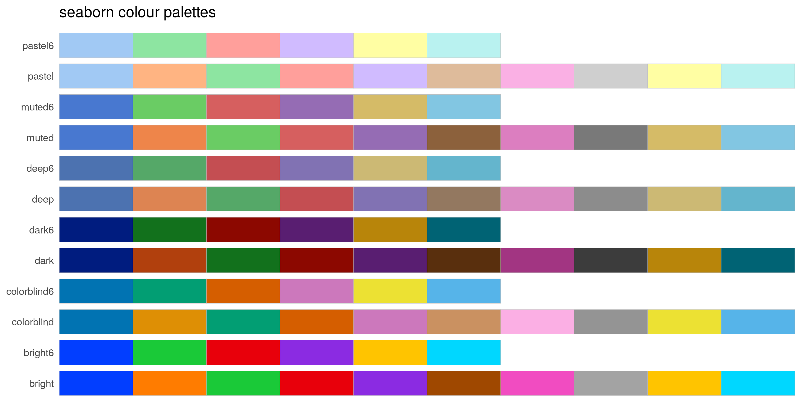

# seaborn_palette

I really like the colour choice in the [seaborn plotting library for python](https://github.com/mwaskom/seaborn) but I use ggplot2 in R, so I created ggplot2 palettes with those colours. I copied the colour choice directly, so thank you to [Michael Waskom](https://github.com/mwaskom) for creating them with an open license.

These are the colours

<!-- badges: start -->

<!-- badges: end -->

